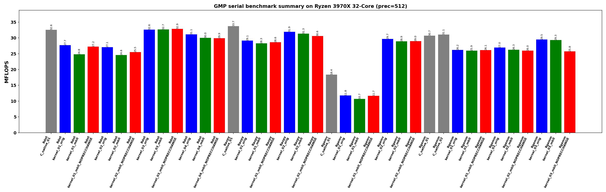
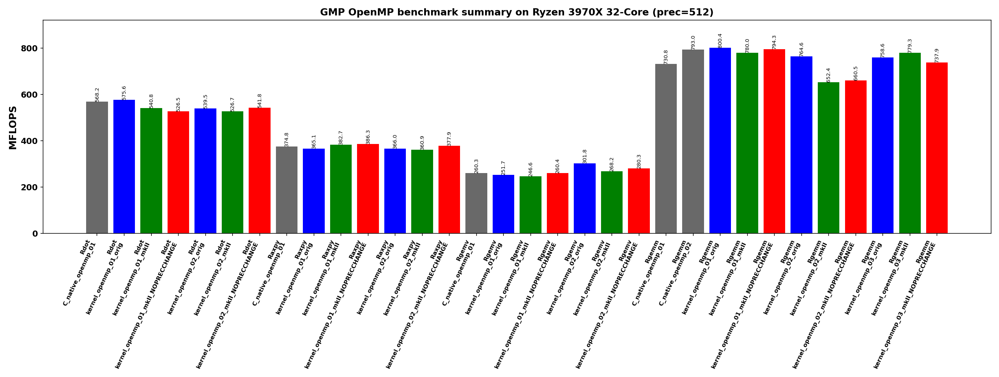

<!-- SPDX-License-Identifier: BSD-2-Clause -->

# Benchmarks

The benchmark tree contains the eager BLAS-like GMP benchmark programs ported
to this repository.  The top-level CMake build creates raw `mpf_t`, upstream
`gmpxx.h`, `gmpxx_mkII`, `gmpxx_mkII` with
`GMPXX_MKII_NOPRECCHANGE`, and OpenMP variants where available.

Build from the repository root:

```bash
cmake -S . -B build_bench_release -DCMAKE_BUILD_TYPE=Release
cmake --build build_bench_release -j
```

Run the full sample dimensions inherited from `go.sh`:

```bash
benchmarks/run_benchmarks.sh build_bench_release 512 \
    100000000 100000000 4000 4000 500 500 500 \
    benchmarks/results-go-sh-sample
```

The plotter writes serial and OpenMP graphs separately:

- `*_serial_summary.{png,pdf}` and `*_serial_<kernel>.{png,pdf}`
- `*_openmp_summary.{png,pdf}` and `*_openmp_<kernel>.{png,pdf}`

The raw log is the authoritative result.  The plotted `MFLOPS` values measure
the timed kernel body, not allocation, random initialization, or verification.
Use `WALL_SECONDS` in the log when total executable time matters.

## Recorded go.sh Sample

The committed sample run is summarized by the serial and OpenMP plots below.





The serial plot is the right place to compare raw `mpf_t`, upstream
`gmpxx.h`, `mkII`, and `mkII_NOPRECCHANGE` without parallel execution effects.
The OpenMP plot answers a different question: whether the chosen loop structure
parallelizes well.  In this run, Rgemm benefits most from OpenMP because its
matrix-matrix kernel has higher arithmetic intensity.  Rdot and Raxpy show
large kernel-body speedups, but their total executable time is still heavily
affected by allocation, random initialization, and verification.  Rgemv
`kernel_openmp_02` reports `Result NG`; treat that plot entry as a benchmark
variant issue until it is fixed.

Benchmark directories:

- [00_Rdot](00_Rdot/README.md): dot product, `sum_i x_i * y_i`.
- [01_Raxpy](01_Raxpy/README.md): AXPY, `y_i = y_i + alpha * x_i`.
- [02_Rgemv](02_Rgemv/README.md): dense matrix-vector multiply.
- [03_Rgemm](03_Rgemm/README.md): dense matrix-matrix multiply.
